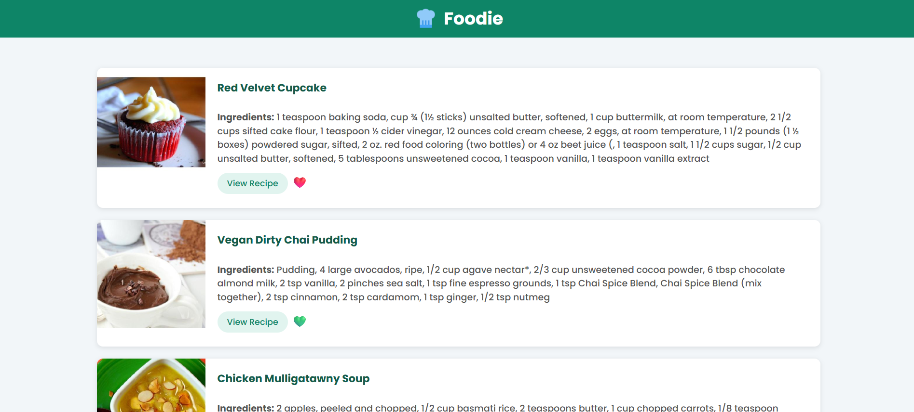
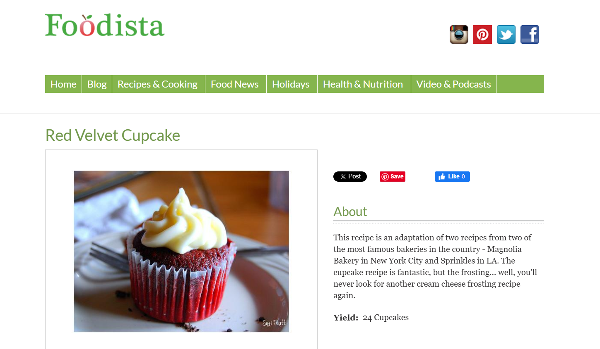

# 🧑‍🍳 Foodie - Recipe Book App

A sleek, modern Recipe Book App built using **HTML**, **CSS**, and **JavaScript** that fetches real-time recipe data from the **Spoonacular API**. This responsive web app allows users to browse recipes, view ingredients, and mark their favorites 💚.





---

## 🌟 Features

- 🔥 Fetches random recipes from the [Spoonacular API](https://www.spoonacular.com/food-api)
- 🖼 Clean card-based UI to showcase each recipe with an image, title, and ingredients
- 💚 Favorite button with toggle animation
- ✅ Fully responsive layout for desktop and mobile
- 🎨 Smooth typography with [Poppins](https://fonts.google.com/specimen/Poppins), soft color palette, and modern shadow effects
- 👨‍🍳 Logo and branding for a professional touch

---

## 🚀 Tech Stack

- **HTML5**: Markup structure
- **CSS3**: Custom styles with Flexbox and media queries
- **JavaScript (ES6)**: DOM manipulation, async/await for API calls
- **REST API**: [Spoonacular API](https://spoonacular.com/food-api)


---

## 🛠️ Getting Started

### 1. Clone the Repository

```bash
git clone https://github.com/yourusername/recipe-book-app.git
cd recipe-book-app
